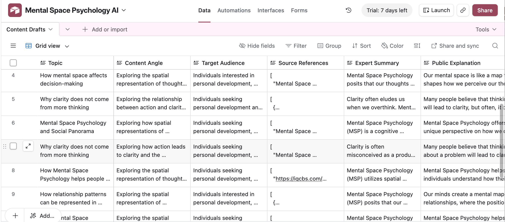
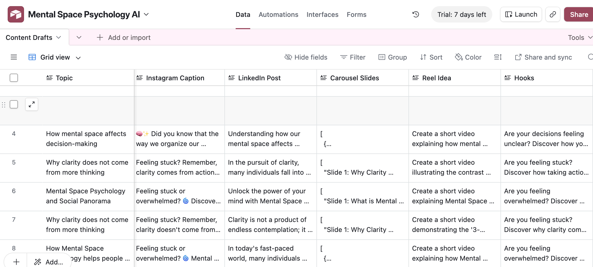
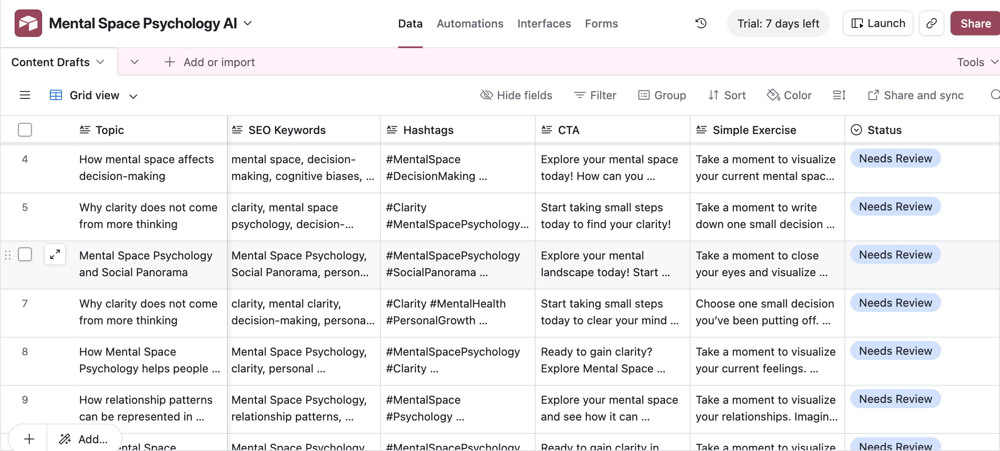

For Isabella:
Dear Isabella, this README is quite long but tries to gather most delivery requirements in one single place, so you can read over them quickly. You will notice that you will find points 3. (Agile Planning Artifacts), 4.(Agent Specification and Instructions), 5. (Generated Report Examples) and 6. (Documentation), mostly covered in this README. I hope it is not too long and tedious. 

# Project Overview

Mental Space Psychology AI is an AI-powered storytelling and content generation system designed to transform trusted Mental Space Psychology (MSP) source material into clear, educational, engaging, and client-attracting communication drafts. The system helps coaches, consultants, therapists, and educators turn complex psychological and transformational concepts into accessible public-facing content for platforms such as Instagram, LinkedIn, newsletters, websites, reels, and carousel posts. 

The project prepares high-quality first drafts for review rather than publishing automatically. 

The system combines:

* Retrieval-Augmented Generation (RAG)
* Internet research
* AI content generation
* Workflow automation
* Structured content storage

The current MVP can:

1. Receive a topic
2. Retrieve MSP source knowledge from Pinecone
3. Conduct internet research using Tavily
4. Generate structured multi-platform content
5. Save drafts to Airtable
6. Send email notifications via n8n Cloud 

---

# Architecture Overview

Current architecture:

```text
n8n Cloud Trigger
↓
HTTP Request
↓
FastAPI endpoint
↓
Python AI agent
↓
Pinecone retrieval
↓
Tavily web research
↓
OpenAI content generation
↓
Airtable draft creation
↓
n8n Gmail notification
```

Main technologies used:

| Component           | Technology                    |
| ------------------- | ----------------------------- |
| AI / LLM            | OpenAI                        |
| Vector Database     | Pinecone                      |
| Web Research        | Tavily                        |
| Automation          | n8n Cloud                     |
| API Layer           | FastAPI                       |
| Storage             | Airtable                      |
| Public API Exposure | ngrok--to be changed to Railway                         |
| Embeddings          | OpenAI text-embedding-3-small |


---

# Core Features

## Retrieval-Augmented Generation (RAG)

* Document chunking
* Embedding creation
* Pinecone similarity retrieval
* Trusted source grounding

Current chunk settings:

```python
chunk_size = 1200
chunk_overlap = 200
```

Supported document formats:

* PDF
* TXT

---

## Internet Research Layer

The system uses Tavily to:

* Search the web for MSP-related information
* Summarize online findings
* Combine web context with trusted uploaded source material

---

## AI Content Generation

The system generates:

* Expert summaries
* Public-friendly explanations
* Instagram captions
* LinkedIn posts
* Carousel outlines
* Reel ideas
* Hooks
* SEO keywords
* Hashtags
* CTAs
* Simple exercises
* Source references

Outputs are returned as structured JSON. 

---

## Airtable Integration

Generated drafts are automatically saved into Airtable.

### Airtable Structure

**Base:** `Mental Space Psychology AI`
**Table:** `Content Drafts`

Fields include:

* Topic
* Content Angle
* Target Audience
* Source References
* Instagram Caption
* LinkedIn Post
* Carousel Slides
* Hooks
* SEO Keywords
* CTA
* Reviewer Notes
* Status

Status workflow:

* Needs Review
* Approved
* Needs Revision
* Rejected
* Published


---

# Project Structure

Example structure:

```text
Project_Story_telling_Agent_for_MSP/
│
├── data/
│   ├── raw_documents/
│   └── processed/
│
├── src/
│   ├── main.py
│   ├── api.py
│   ├── document_loader.py
│   ├── chunker.py
│   ├── vectorstore.py
│   ├── retriever.py
│   ├── internet_research.py
│   ├── generator.py
│   ├── airtable_writer.py
│   └── procfile
    └── topic_manager.py
    └── config.py
│
├── .env
├── requirements.txt
├── .gitignore
└── README.md
```

---

# Environment Setup

## 1. Clone the Repository

```bash
git clone <your-repository-url>
cd Project_Story_telling_Agent_for_MSP
```

## 2. Create Virtual Environment

```bash
python3 -m venv .venv
source .venv/bin/activate
```

---

## 3. Install Dependencies

```bash
pip install -r requirements.txt
```

---

# Required Environment Variables


OPENAI_API_KEY=

PINECONE_API_KEY=y
PINECONE_ENVIRONMENT=
PINECONE_INDEX_NAME=

TAVILY_API_KEY=

AIRTABLE_API_KEY=
AIRTABLE_BASE_ID=
AIRTABLE_TABLE_NAME=
```

---

# Required Python Packages

Example dependencies:

jupyter
ipykernel
python-dotenv
langchain
langchain-openai
langchain-community
langchain-text-splitters
langchain-pinecone
pinecone
pypdf
docx2txt
tiktoken
tavily-python
pyairtable
fastapi
uvicorn
```

---

# Running the Project

## Step 1 — Start FastAPI Server

```bash
source .venv/bin/activate
uvicorn src.api:app --reload --port 8001
```

Current endpoint:

```text
POST /generate-content
```


---

## Step 2 — Start ngrok

Expose the local FastAPI server publicly:

```bash
ngrok http 8001
```

Example public URL:

```text
https://xxxxx.ngrok-free.app
```


---

## Step 3 — Configure n8n Cloud

HTTP Request Node settings:

```json
{
  "topic": "{{$json.topic}}"
}
```

Endpoint:

```text
https://xxxxx.ngrok-free.app/generate-content
```


---

# Running Content Generation Locally

Current `main.py` supports:

### Standard generation

```python
run_agent()
```

### Custom topic generation

```python
run_agent(topic="Why clarity does not come from more thinking")
```

### Optional Pinecone rebuild

```python
build_vector_database()
```

The Pinecone rebuild step is intentionally commented out and should only be enabled when new source documents are added. 

---

# Example Workflow

Input topic:

```text
Why clarity does not come from more thinking, but from reorganizing mental space
```

System workflow:

1. Retrieve relevant MSP knowledge
2. Research supporting online information
3. Extract key concepts and client pain points
4. Generate structured content package
5. Save results to Airtable
6. Notify user via email

Outputs may include:

* Instagram caption
* LinkedIn post
* Reel idea
* Carousel outline
* Hooks
* CTA
* SEO keywords
* Source references


---

# MVP Goals


* Produces accurate and source-grounded content
* Generates clear and engaging communication
* Reduces manual content creation time
* Maintains brand alignment
* Supports human review workflows

The system is designed to prepare communication drafts — not to publish automatically. 

---

# Future Improvements

Planned Version 2 features:

* Topic memory
* Brand voice memory
* Feedback loops
* Analytics tracking
* Autonomous scheduled generation
* Social media planner integration
* Learning from reviewer feedback


---

# Current MVP Status

Fully operational components:

* Local AI agent
* Pinecone RAG
* Tavily research
* OpenAI generation
* Airtable integration
* FastAPI API layer
* ngrok public access --> to be changed to railway
* n8n Cloud automation
* Gmail notifications


# Why This Framework and Workflow Approach Was Chosen

The architecture was intentionally designed as a modular, practical, and beginner-friendly AI workflow that could realistically be built by me in a week, while still supporting advanced AI capabilities like RAG, automation, and multi-step reasoning.

The main reason for this workflow design is that the project is that it needed to be simple,and at the same time understand trusted Mental Space Psychology material, retrieve relevant information,
conduct external research, reason across multiple sources, generate platform-specific content,
store outputs, and prepare everything for human review.

# Why Python Was Chosen as the Core Intelligence Layer

Python became the central orchestration layer because, not only was it what we had learned, but  it offers: flexibility, compatibility with LangChain/RAG tooling, easy API integration, and scalability 

Python handles: retrieval, prompt orchestration, internet research, structured generation, vector search, and external integrations.

# Why Pinecone Was Chosen for RAG

Mental Space Psychology is a niche and specialized field with little info online. General LLM knowledge alone is not reliable enough for accurate explanations or brand-aligned communication.

Pinecone was chosen because it is scalable, it is what we had used, scales well, 

# The RAG layer 
used to:

retrieve source chunks,
ground outputs in real MSP material,
reduce hallucinations,

This is essential because the project focuses on psychologically sensitive and transformation-related topics where unsupported claims should be avoided.

# Why Tavily Was Chosen for Internet Research

NEed for structured internet research on MSP

The goal was not to replace trusted MSP material, but to enrich it with recent information and
supporting context.

# Why FastAPI Was Chosen

n8n Cloud cannot directly execute local Python scripts or terminal commands. Because of this limitation, FastAPI was introduced as an API bridge between n8n Cloud and the local Python AI agent.

FastAPI was chosen because it is lightweight, easy to deploy and beginner-friendly.

# Why ngrok Was Used and then Railroad

During MVP development, the system ran locally. Ngrok was used to temporarily expose the FastAPI server publicly. In order to reduce fragility, Railroad was then used for a stable URL. 

# Why n8n Cloud Was Chosen

n8n Cloud was selected as the automation layer because it simplifies workflow orchestration,
supports HTTP/API integrations, handles scheduling, manages notifications, and reduces backend complexity.

# Why Airtable Was Chosen

The project needed a lightweight review database that non-technical users could easily interact with.

# benfits  of the tool

A single-prompt system would not be reliable enough for:

psychological accuracy,
source transparency,
content consistency,
brand alignment,


The workflow therefore separates the process into stages:

Input topic
Retrieve trusted material
Conduct web research
Aggregate context
Extract concepts
Identify audience pain points
Generate structured outputs
Save for review
Notify the user

This staged workflow improves:

controllability,
debugging,
scalability,
and future autonomy.

# Agile User Stories and Sprint Planning — Mental Space Psychology AI

## User Story 1 — Trusted Knowledge Retrieval

As Julia G, I want to have a tool that can retrieve information from all the major Mental Space Psychology books, PDFs, transcripts, and trusted source documents so that the generated content is accurate, aligned with MSP principles, and not based on generic internet knowledge.

### Sprint Tasks

* Create document loading pipeline for PDFs and TXT files
* Implement document chunking
* Create embeddings using OpenAI embeddings
* Upload vectors into Pinecone
* Build similarity retrieval system
* Test retrieval quality with MSP-related prompts

### Difficulty Estimate

Medium (7/10)

### Dependencies

* OpenAI API setup
* Pinecone setup
* Local Python environment
* Source documents available

### Definition of Done

* Documents can be uploaded and processed successfully
* Chunks are stored in Pinecone
* Relevant MSP chunks are retrieved through semantic search
* Retrieval outputs are relevant and grounded in uploaded material

---

# User Story 2 — AI Content Generation

As Julia G, I want the system to use the retrieved MSP information to generate high-quality content for Instagram, LinkedIn, newsletters, reels, and carousel posts so that I can consistently educate and attract potential clients without manually creating every piece of content from scratch.

### Sprint Tasks

* Create structured prompt templates
* Build OpenAI content generation pipeline
* Generate Instagram captions
* Generate LinkedIn posts
* Generate carousel outlines
* Generate hooks, hashtags, SEO keywords, and CTAs
* Structure outputs into JSON format

### Difficulty Estimate

Medium (7/10)

### Dependencies

* Working retrieval system
* OpenAI API integration
* Prompt engineering workflow

### Definition of Done

* The system generates complete multi-platform content packages
* Outputs are structured and readable
* Content reflects MSP concepts accurately
* Outputs are usable as first drafts for review

---

# User Story 3 — Internet Research Enrichment

As Julia G, I want the system to search the internet for additional relevant information about Mental Space Psychology and related transformation topics so that the generated content has richer context and supporting information beyond the uploaded documents.

### Sprint Tasks

* Integrate Tavily API
* Create web research module
* Summarize online findings
* Combine online context with RAG retrieval
* Prevent web research from overriding trusted MSP sources

### Difficulty Estimate

Medium (6/10)

### Dependencies

* Tavily API access
* Existing retrieval pipeline
* Context aggregation workflow

### Definition of Done

* The system can retrieve relevant online information
* Internet summaries are combined with MSP retrieval
* Source references are included
* Trusted MSP sources remain prioritized

---

# User Story 4 — Centralized Content Storage

As Julia G, I want all generated content to be stored automatically in one centralized place like Airtable so that I can review, organize, edit, and track all drafts in a structured workflow.

### Sprint Tasks

* Create Airtable base and schema
* Build Airtable API integration
* Map generated content fields
* Save outputs automatically
* Add review status fields

### Difficulty Estimate

Medium (5/10)

### Dependencies

* Airtable API setup
* Structured content generation
* JSON output formatting

### Definition of Done

* Content is automatically saved into Airtable
* All fields map correctly
* Drafts receive a review status
* The database can be used as a centralized content review system

---

# User Story 5 — Automated Workflow Triggering

As Julia G, I want the system to trigger automatically every second day so that I do not need to manually plan or start the content creation workflow myself.

### Sprint Tasks

* Create n8n Cloud workflow
* Configure schedule trigger
* Connect HTTP request to FastAPI endpoint
* Test automated workflow execution
* Handle workflow errors

### Difficulty Estimate

Medium (6/10)

### Dependencies

* Working FastAPI endpoint
* Public API exposure through ngrok
* Functional AI agent pipeline

### Definition of Done

* The workflow triggers automatically on schedule
* The HTTP request reaches the AI agent
* Content generation runs successfully without manual intervention
* Errors are logged and manageable

---

# User Story 6 — Email Notifications

As Julia G, I want to receive an email notification every second morning when new content drafts are ready so that I remember to review the generated content and keep my communication consistent.

### Sprint Tasks

* Configure Gmail integration in n8n
* Create notification node
* Connect notification to successful Airtable draft creation
* Test delivery workflow

### Difficulty Estimate

Low (4/10)

### Dependencies

* n8n workflow functioning
* Gmail credentials configured
* Airtable workflow completed successfully

### Definition of Done

* Emails are automatically sent after successful content generation
* Notifications arrive reliably
* The notification confirms that drafts are ready for review

---

# User Story 7 — Human-Reviewed Safety Workflow

As Julia G, I want all generated content to remain human-reviewed before publishing so that I maintain ethical responsibility, accuracy, and brand quality.

### Sprint Tasks

* Add review status system in Airtable
* Prevent automatic publishing
* Create “Needs Review” workflow state
* Add reviewer notes fields

### Difficulty Estimate

Low (3/10)

### Dependencies

* Airtable integration
* Structured storage workflow

### Definition of Done

* All generated drafts are marked as “Needs Review”
* No content is automatically published
* Reviewer notes can be added before publication

---

# User Story 8 — End-to-End MVP Workflow

As Julia G, I want the entire workflow to function as one connected system so that I can enter or schedule a topic and automatically receive structured MSP content drafts with minimal manual work.

### Sprint Tasks

* Connect retrieval pipeline
* Connect web research
* Connect generation pipeline
* Connect Airtable integration
* Connect n8n automation
* Connect email notification system
* Perform full end-to-end testing

### Difficulty Estimate

High (9/10)

### Dependencies

* All previous user stories completed

### Definition of Done

* A topic can trigger the full workflow
* MSP retrieval functions correctly
* Web research enriches the context
* Multi-platform content is generated
* Drafts are saved in Airtable
* Email notifications are sent successfully
* The workflow runs consistently from start to finish without manual intervention except final human review

# Examples of the generated work



